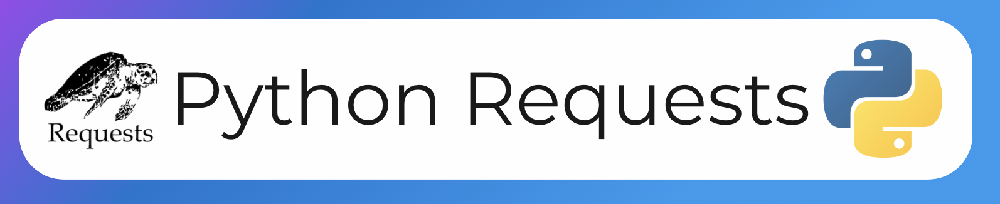

# Requests Library Testing Project

  <!-- Adjust the file extension if necessary -->

## Overview

This project is designed to te


st and demonstrate the capabilities of the Python `requests` library. The `requests` library is a powerful tool for making HTTP requests in Python, and this project includes examples and tests to help users understand how to utilize it effectively.

## Table of Contents

- [Features](#features)
- [Installation](#installation)
- [Usage](#usage)
- [Examples](#examples)
- [Running Tests](#running-tests)
- [Contributing](#contributing)
- [License](#license)

## Features

- Easy-to-use interface for making HTTP requests
- Examples of GET, POST, PUT, and DELETE requests
- Error handling and response validation
- Comprehensive test cases to ensure functionality

## Installation

To get started with this project, follow these steps:

1. Clone the repository:
   ```bash
   git clone https://github.com/szymonizydorek/requests-testing-project.git
   cd requests-testing-project

